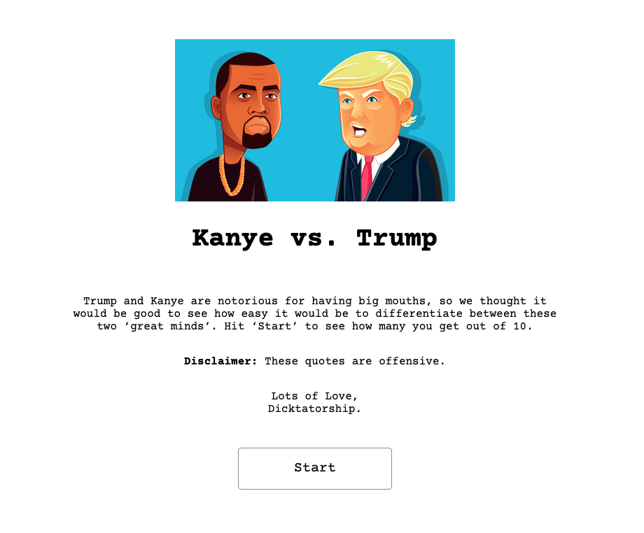
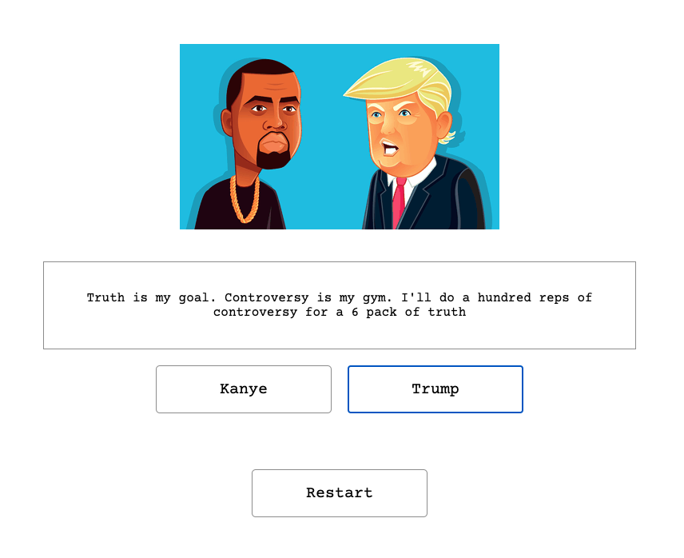
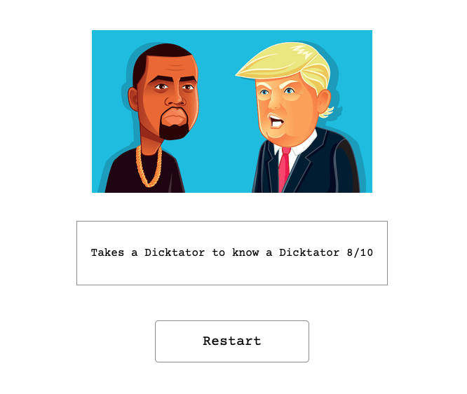

# sei-project-2
### Timeframe
2 day, hackathon style, pair coded
Technologies used
•	React
•	CSS 
•	API, Axios and Insomina
•	GitHub

## Installation
1.	Clone or download the repo
2.	Open the index.html in your browser of choice

## My Game - Trump vs Kanye

You can find a hosted version here ----> https://trump-vs-kanye.netlify.app// 

## Game overview

A fun game that generates a random quote and you have to guess whether it was said by Kanye or Trump

## Game Instructions

1.	The game begins with an indroduction page explaining the game.

2.	Then the game begins, 10 quotes are generated and the player guesses who saiad it. Each go the correct answer flashes green once the player has guessed.

3.	After 10 guesses a final result is shown with an insult depending on what score the player recieved.

## Process

We first spent time reaseaching a fun API or two to use and came across these two and couldnt resist the chance to play the game ourselves. 
First, we used Insomnia to check the APis and what data they gave us. 
Then once we knew the data structure we set up the game using react. The game only has the landing page and the game page, the content just re-renders when a new quote is pulled. 

### Challenges
Making sure we didn't get the same quote twice, becuase both APIs just generate a random quote. 
Randomising between which API we pulled the quote from to make the game good. 

### Future features
In the future I would like to make it so the button the person click flashes green or red depending on if it is a correct guess not just the correct answer flash green. 

